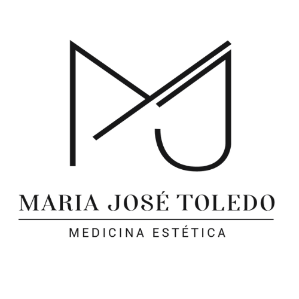

# Dra. María José Toledo — Medicina Estética (Web Project)

A premium, modern web application for **Dra. María José Toledo**, Master Injector specialized in natural facial harmonization in Recoleta, Buenos Aires.



## 🏛️ Project Architecture

This project is built using modern web standards to ensure high performance, SEO optimization, and a premium user experience:

- **Core**: [React 19](https://react.dev/) + [TypeScript](https://www.typescriptlang.org/)
- **Bundler**: [Vite](https://vite.dev/)
- **Styling**: [Tailwind CSS](https://tailwindcss.com/)
- **Typography**: 
  - **Serif**: Cormorant Garamond
  - **Sans**: PP Neue Montreal (Premium Custom Font)
- **Palette**: A sophisticated "Nude & Gold" aesthetic (Cream, Gold, Ink, Blush).

## 🚀 Getting Started

1. **Install Dependencies**:
   ```bash
   npm install
   ```

2. **Run Development Server**:
   ```bash
   npm run dev
   ```

3. **Build for Production**:
   ```bash
   npm run build
   ```

## ✨ Features

- **Responsive Design**: Fully optimized for mobile, tablet, and desktop.
- **Micro-animations**: Smooth transitions and hover effects.
- **SEO Optimized**: Semantic HTML and descriptive meta tags.
- **Sectioned Layout**:
  - `Hero`: High-impact landing with translucent overlays.
  - `About`: Professional profile and philosophy.
  - `Treatments`: Detailed aesthetic medicine services.
  - `Philosophy`: Core values and medical approach.
  - `Reviews`: Google Maps' patient feedback integration mockup.
  - `Contact`: Direct booking and location info.

---
*Created with ❤️ by Antigravity*

